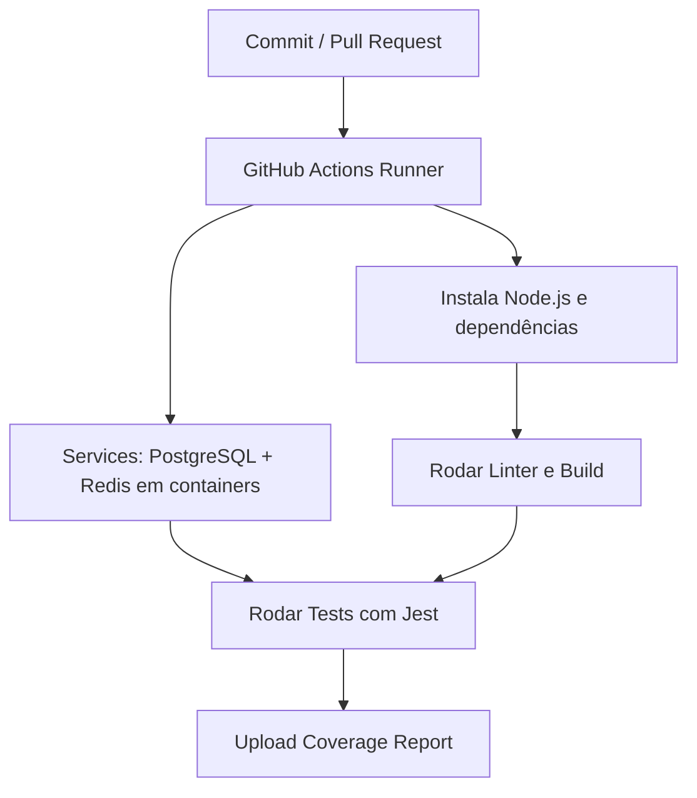
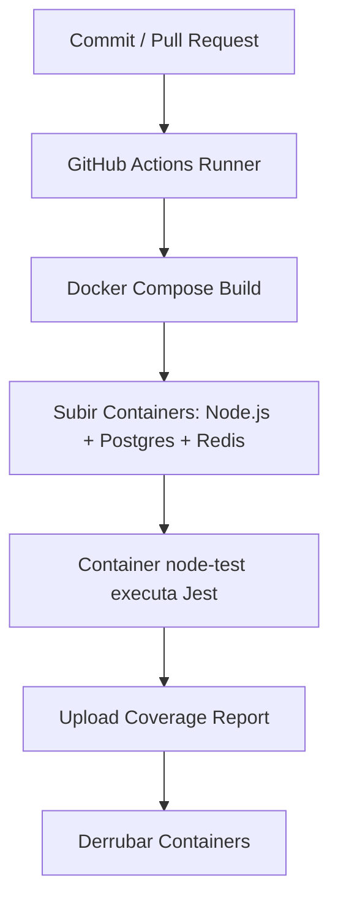

## Testes com Integração Contínua

Este projeto demonstra o uso de Integração Contínua (CI) em uma aplicação Node.js/TypeScript com Express, incluindo:
- Banco de dados PostgreSQL
- Redis para blacklist de tokens
- Autenticação com JWT
- Docker/Docker Compose para isolar os recursos de teste
- Jest + Supertest para escrever e executar os testes automatizados
- GitHub Actions para o pipeline de CI

---


### 📌 Objetivo

- Mostrar boas práticas em testes de integração em aplicações web.
- Isolar os testes em uma pasta dedicada (`tests/`).
- Configurar Postgres e Redis de forma efêmera com Docker para os testes.
- Validar fluxos de autenticação (login, logout, blacklist de tokens) de ponta a ponta;
- Demonstrar duas estratégias de CI no GitHub Actions:
  1. Runner + Services (mais simples, executa Node.js no runner e Postgres/Redis em containers);
  2. Docker Compose (todo o ambiente roda em containers, garantindo paridade com o ambiente local).

---


### 🧑‍💻 Tecnologias Utilizadas

- Node.js + TypeScript – aplicação principal
- Express – servidor HTTP
- PostgreSQL – banco de dados
- Redis – armazenamento da blacklist de tokens JWT
- Docker + Docker Compose – orquestração dos serviços de teste
- Jest – framework de testes
- Supertest – simulação de requisições HTTP para testes de integração


---


### 📂 Estrutura de Pastas

```bash
app/
├── .github/
│   └── workflows/
│       ├── ci-containers.yml   # Pipeline usando Docker Compose
│       └── ci-services.yml     # Pipeline usando runner + services
│   
├── src/                     # Código da aplicação
│   ├── configs/             # Conexão com Postgres e Redis
│   ├── controllers/         # Controllers (ex: user.controller.ts)
│   ├── middlewares/         # Middlewares (auth, validação, erros)
│   ├── routes/              # Rotas Express
│   ├── types/               # Tipagem customizada
│   ├── utils/               # Funções auxiliares (ex: JWT)
│   └── index.ts             # Inicialização do servidor
│
├── tests/                   # Casos de teste (isolados da aplicação)
│   ├── controllers/         # Testes de controllers com Supertest
│   ├── helpers/             # App de teste sem app.listen()
│   └── jest.setup.ts        # Setup global (conexão e limpeza do BD/Redis)
│
├── .env                     # Configuração local
├── .env.test                # Para testes no host
├── .env.ci.containers       # Para CI usando Docker Compose
├── .env.ci.services         # Para CI usando runner + services
├── docker-compose.test.yml  # Serviços de teste (Postgres/Redis)
├── Dockerfile.test
├── eslint.config.mjs
├── jest.config.js           # Configuração do Jest
├── package-lock.json
├── package.json
├── tsconfig.eslint.json
└── tsconfig.json

```


---


### ▶️ Execução Local

1. Clonar o repositório e instalar dependências
```bash
git clone https://github.com/arleysouza/ci-test.git app
cd app
npm i
```

2. Configurar PostgreSQL
- Criar o banco `bdaula`;
- Rodar os comandos SQL do arquivo `src/configs/comandos.sql`.

4. Subir o Redis com Docker
```bash
docker run --name redis -p 6379:6379 -d redis:alpine redis-server --requirepass 123
```
ou

```bash
npm run redis-start
```

5. Iniciar o servidor
```
npm start
npm run dev
```
O arquivo `/http/requests.http` contém as requisições da aplicação (login, registro, logout, CRUD de contatos).
Para executá-las diretamente no VSCode, instale a extensão:
👉 REST Client (autor: Huachao Mao)

Após instalar, basta abrir o arquivo `requests.http`, clicar em `Send Request` sobre a requisição desejada, e o VSCode mostrará a resposta no editor.

6. Executar testes localmente
Graças à configuração do `package.json`, o comando `npm run test` já cuida de todo o ciclo de testes:
1. Sobe containers de PostgreSQL e Redis definidos em `docker-compose.test.yml`;
2. Executa os testes com Jest + Supertest;
3. Para os containers ao final;
Comando único para rodar tudo:
```bash
npm run test
```


---


### 🚀 Execução no GitHub Actions

O projeto oferece duas estratégias de CI.

1. **Runner + Services** (arquivo `ci-services.yml`)
- O Node.js roda direto no runner (ubuntu-latest).
- Postgres e Redis são declarados em `services:` e sobem em containers auxiliares.
- O schema do banco é criado via `psql -f src/configs/comandos.sql`.
- `NODE_ENV=ci.services` garante o carregamento das variáveis corretas.

2. **Docker Compose** (arquivo `ci-containers.yml`)
- Todo o ambiente (Node.js, Postgres e Redis) sobe em containers.
- O GitHub Actions apenas orquestra os comandos `docker compose build` e `docker compose up`.
- Garante paridade total entre ambiente local e CI.
- `NODE_ENV=ci.containers` é usado para carregar variáveis do `.env.ci.containers`.

📌 Apenas um arquivo (`ci-services.yml` ou `ci-containers.yml`) deve estar ativo por vez. Renomeie o que não for usar (ex.: `ci-services.disabled`).


---

### 🔑 Endpoints

**Registro de usuário**
``` bash
POST /users
```

**Login**
``` bash
POST /users/login
```
Resposta (exemplo):
```bash
{ "token": "eyJhbG..." }
```

**Logout**
``` bash
POST /users/logout
```
Invalida o token atual adicionando-o à blacklist no Redis.


---

### 📊 Comparativo: Runner + Services vs Docker Compose

| Critério                        | Runner + Services (`ci-services.yml`) | Docker Compose (`ci-containers.yml`)                               |
| ------------------------------- | ------------------------------------- | ------------------------------------------------------------------ |
| **Execução do Node.js**         | No runner (VM do GitHub)              | Em container isolado (`node-test`)                                 |
| **Banco de dados e Redis**      | Declarados em `services:`             | Definidos no `docker-compose.test.yml`                             |
| **Paridade com ambiente local** | Parcial (diferenças podem surgir)     | Total (mesma stack de containers)                                  |
| **Complexidade**                | Mais simples                          | Mais completo e próximo do real                                    |
| **Velocidade**                  | Geralmente mais rápido                | Um pouco mais lento (build de imagens)                             |
| **Portabilidade**               | Menor (depende do runner)             | Maior (mesma config local/CI)                                      |
| **Uso recomendado**             | Projetos simples, pipelines rápidos   | Projetos com stack mais complexa ou que exigem ambientes idênticos |


---

### 🔄 Fluxo de Execução do Pipeline

**Runner + Services**


**Docker Compose**
